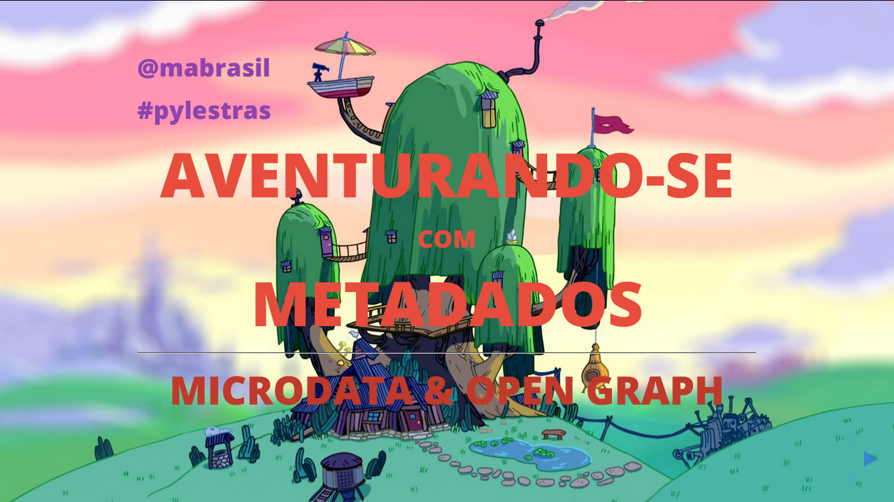

# De volta para o futuro: a importância de funcional nos dias atuais

## The talk

- **Title:** *De volta para o futuro: a importância de funcional nos dias atuais*
- **When:** September, 19
- **Where:** Universidade de Fortaleza - Unifor.
- **Attendees:** ≈50
- **Description:** [Ian](https://github.com/IanRamosC) and I will highlight certain parts of large project development where functional programming may be the right choice. We'll show a little on history and also why and how functional programming has been being the best alternative to scale.
- **Presentation:** [See it live here](http://mabrasil.github.io/talks/2015/unidev/).

## The slides

These slides are made using [xzibit](https://github.com/mabrasil/xzibit) v.1.0.0. To get more info on how to run and that kind of things, visit the project's page.

The slides' content is licensed under a [Creative Commons Attribution 3.0 Unported License](http://creativecommons.org/licenses/by/3.0/deed.en_GB).
